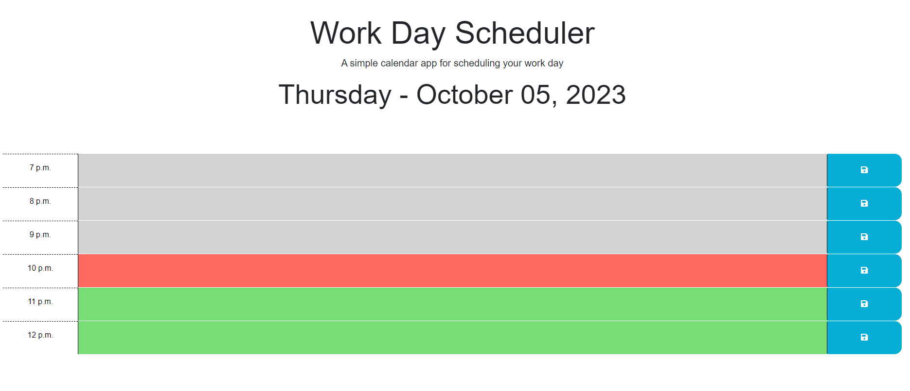

# simple-calander

[Visit the Deployed Site](https://azurek17.github.io/simple-calander/)

### Technoloy used:
* JavaScript - If... Statement - https://www.w3schools.com/jsref/jsref_if.asp
* JavaScript - Logical Operators - https://www.w3schools.com/java/java_operators.asp
* JavaScript - For Loop - https://www.w3schools.com/java/java_for_loop.asp
* jquery - https://jquery.com/
* Day.js - https://day.js.org/

## Description

A simple calander which allows a person to save comments for each hour during typical work hours.  Start code was provided. See credits for URL link. 

## Usage
When you go to the website, you will see the the current day. this was accomplished by using Day.js.

As you scroll down, you will see hourly time blocks, which you can input text into the timeblock and save.  this was accomplished using jQuery.   

Below are a few examples of code:
 -------------------------------

### Day.js

    function currentTime(){
    var today = dayjs();
    $("#currentDay").text(today.format("dddd - MMMM DD, YYYY"));
    }
    currentTime();

 -------------------------------

### Jquery & EventListner

    $(".saveBtn").on("click", function (){
      var hourSaved = $(this).parent().attr("id");
      var userInput = $(this).siblings(".description").val();
      console.log(localStorage);
      localStorage.setItem(hourSaved, userInput);
    });

 -------------------------------

### For Loop and IF statement

    for (var i = 0; i < workHours.length; i++){
        var hours = `${workHours[i]} a.m.`;
        if(workHours[i] > 11){
        hours = `${workHours[i]} p.m.`;
        if(workHours[i] > 12)  hours = `${workHours[i] - 12} p.m.`;
        };

## Credits
* Stater code provided: https://github.com/coding-boot-camp/crispy-octo-meme
* AskBCS Learning Assistant: Jchance
* Tutoring Session: Corrado Alfano
* StudyGroup

----------------------------------------------------------------------------------
© 2023 github.com/AZurek17/simple-calander Confidential and Proprietary. All Rights Reserved.

